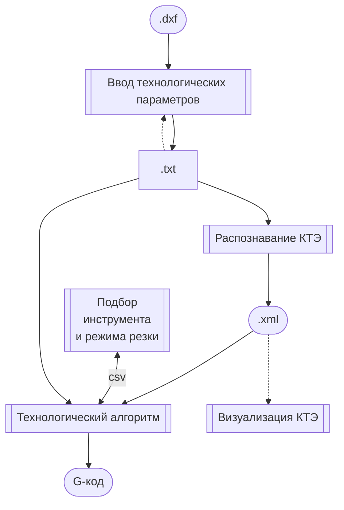

# KTE

Automated CAM for Turning

## Архитектура

## Used software

- [LiveScript]
- [Mithril.js]
- [easysax]
- [rollup.js]
- ...

[Mithril.js]: https://mithril.js.org/
[LiveScript]: https://livescript.net/
[easysax]: https://github.com/vflash/easysax
[rollup.js]: https://rollupjs.org/
