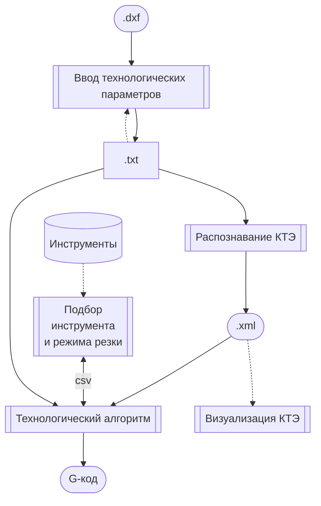

# Документация

## Архитектура

```mermaid
%% VSCode:
%% bierner.markdown-mermaid
%% bpruitt-goddard.mermaid-markdown-syntax-highlighting

flowchart TD

DXF([.dxf]) --> S0[[Ввод технологических параметров]]
S0 --> TXT[.txt]
TXT --> S1[[Распознавание КТЭ]]
TXT -.-> S0
S1 --> XML([.xml])
XML --> S2[[Технологический алгоритм]]
XML -.-> V[[Визуализация КТЭ]]
S2 --> G([G-код])
DB[[Подбор <br>инструмента <br>и режима резки]] <--csv--> S2
XLS[(Инструменты)] -.-> DB
TXT --> S2

click S1 href "rec"
click S2 href "lathe"

```

## Описания алгоритмов

- [Распознавание КТЭ](rec)
- [Технологический алгоритм](lathe)
