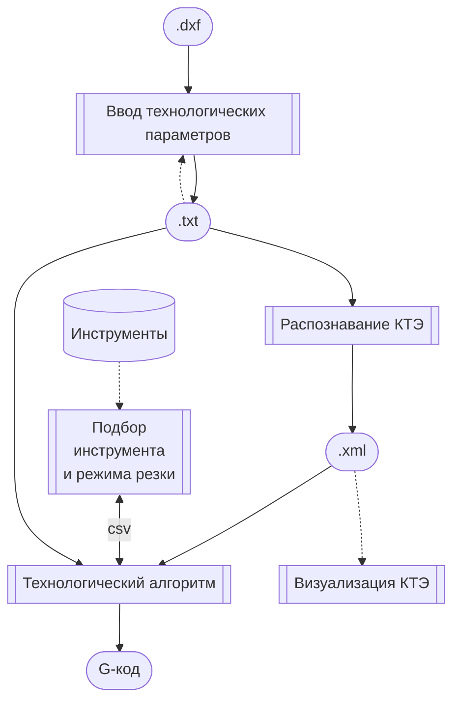

# Документация

## Архитектура

## Программные модули
+ Интерактивная утилита конвертации DXF-файла и ввода технологических параметров (Web)
+ Утилита распознавания КТЭ (командная строка)
+ Утилита выбора инструмента и режима резания
+ Утилита просмотра списка КТЭ (Web)
+ Утилита генерации управляющих программ (командная строка)

## Форматы файлов данных
+ [DXF]
+ [STEP]
+ Задание на распознавание КТЭ
+ [Список КТЭ][kte]
+ Модуль поиска инструмента и режимов резания
  - Входной файл
  - Выходной файл

[DXF]: http://images.autodesk.com/adsk/files/autocad_2012_pdf_dxf-reference_enu.pdf
[STEP]: https://www.loc.gov/preservation/digital/formats/fdd/fdd000448.shtml
[kte]: rec/RecognitionResultFileFormat.docx

## Описания алгоритмов

- [Распознавание КТЭ](rec)
- [Технологический алгоритм](lathe)
