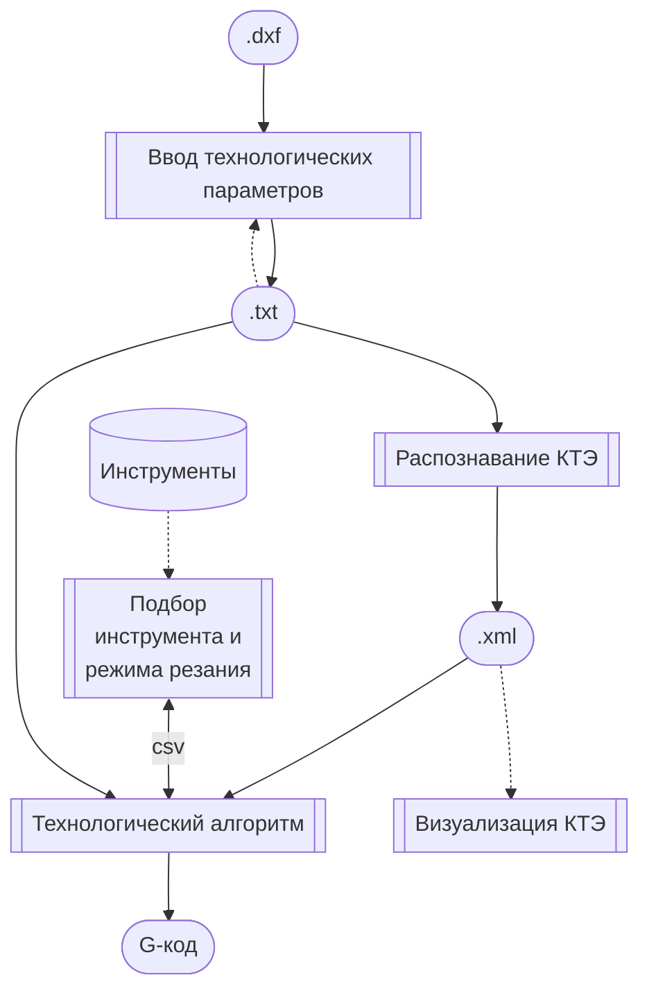

# Документация

См. отчёт
[Разработка технологических алгоритмов](<Разработка технологических алгоритмов.docx>)

## Архитектура системы

## Программные модули
+ Интерактивная [утилита конвертации DXF-файла и ввода технологических параметров][input] (Web)
+ [Утилита распознавания КТЭ](cpp/) (командная строка)
+ [Утилита выбора инструмента и режима резания](tooling/)
+ [Утилита просмотра списка КТЭ][view] (Web)
+ [Утилита генерации управляющих программ][ncp] (командная строка)

[input]: node/input.md
[view]:  node/view.md
[ncp]:   node/ncp.md

## Форматы файлов данных

+ Исходные файлы с геометрией детали
  - [.dxf][DXF]
  - [.step][STEP]
+ .txt: [Задание на распознавание КТЭ][txt]
+ .xml: [Список КТЭ][kte]
+ Модуль поиска инструмента и режимов резания
  - [Входной файл](tooling/in.md)
  - [Выходной файл](tooling/out.md)

[DXF]: http://images.autodesk.com/adsk/files/autocad_2012_pdf_dxf-reference_enu.pdf
[STEP]: https://www.loc.gov/preservation/digital/formats/fdd/fdd000448.shtml
[txt]: rec/input.md
[kte]: rec/RecognitionResultFileFormat.docx

## Описания алгоритмов

- [Распознавание КТЭ](rec)
- [Технологический алгоритм](lathe)
